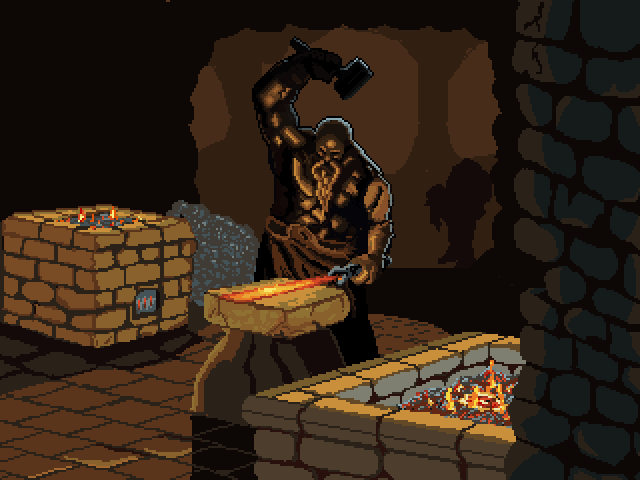

# Forging future
 

After my first year in university, I decided to practice the knowledge that I've gained, which was mainly in DSA, OOP and STL containers in C++.

# [ Notice! ] - "The unofficial certification"
The main language that I am working with here is <b>C++</b> and the problems that I attempt to solve are from one software academy. 
They have a lot of courses for which I cannot afford to go through, but thanks to my university I've advanced my knowledge for most of them already. 
Now it's just a matter of time for me to **prove** that by solving all problems that they offer to their participants and non-participants like me in this case :D. 
With that said, I hope this repo will serve as the most of the programmer's certifications.

## Purpose

    The repository is created for the sake of self-improvement and as a compensation for not uploading all my homeworks that I've been working on during that first year.
    The problem is that I was constantly switching different IDEs in order to find a good field in which I would form the right habits as well as having my files well-organised and flexible.

* I might consider adding some old files here in the near future if I haven't already.

## Goal

The goal is simple - practice all programming concepts by solving different problems from the Internet & upload all the progress every single day.

